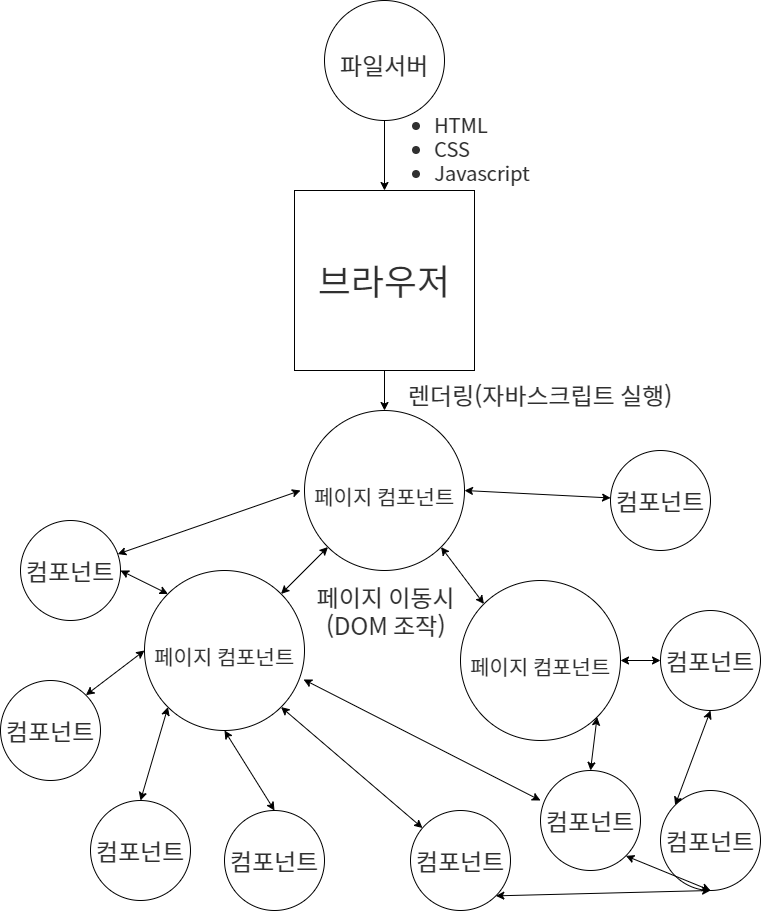

## 클라이언트 사이드 렌더링(CSR)

클라이언트 사이드측에서 렌더링하는 방식, 이 방식을 활용한 기술로 SPA(Single Page Application)이 있다. 여기서 말하는 클라이언트는 유저가 사용하는 브라우저를 말한다. SPA라는 개념은 페이지가 딱 한개 존재하고 사용자가 어떤 행위를 취했을 때(회원 가입 버튼을 클릭한다거나 다른 경로로 이동하는 버튼을 눌렀을 때 등) 다른 페이지를 불러오지 않고 자바스크립트를 이용해 사용자가 보고있는 부분(View)을 DOM의 조작을 통해 변경한다.

### SPA가 사용되기 전

SPA와 대립되는 개념인 MPA(Multi Page Application)가 있다. 말 그대로 다양한 페이지가 있는 앱을 말한다. 다양한 경로에 HTML 파일이 존재한다는 얘기다. SPA에서는 모든 경로에 대해 하나의 페이지인 **index.html**을 내보내기만 하면 된다. 여기서 404 처리, 오류 처리 등 다양한 처리를 자바스크립트를 이용해서 할 수 있다.

멀티 페이지 애플리케이션에서는 각각의 경로마다 다양한 HTML 파일이 있기 때문에 사용자가 그 경로에 이동할 때 마다 서버와 통신하여 HTML 파일을 다운로드 받아야하고, UI를 구성하기 위해 여러 스타일 파일 혹은 필요하다면 자바스크립트 파일을 서버로부터 다운로드 받아야한다. 그렇기 때문에 SPA와 비교했을 때 서버와의 통신이 더 많은 편이다.

### SPA 동작 방식

맨 처음 서버에서 필요한 자원을 요청해서 모두 받는다. (HTML, CSS, 자바스크립트) 이 파일들이 모두 받아지고 브라우저에서 자바스크립트를 실행하게 되면 내부적으로 DOM을 매우 효율적으로 조작하여 페이지의 다양한 부분을 구성한다.

이 때, 다양한 부분은 개발할 때 다양한 컴포넌트로 나눌 수 있으며 컴포넌트로 나누게 되면 나중에 유지보수하기 용이하고 가독성도 좋아지며 개발하기 매우 편해지는 이유 덕분에 많이 권장하고 있는 편이다. 물론 하나의 컴포넌트에 모든 컴포넌트의 기능을 때려박아도 상관없다.

그 후 경로 변경이 일어나거나 사용자가 어떤 행위를 취할 때, 페이지 컴포넌트를 바꾸거나 특정 컴포넌트의 특정 부분만 재 렌더링 시킨다. MPA에서는 다른 경로로 이동하게 된다면 그 경로의 페이지를 그리기 위해 많은 요소들을 다시 서버로부터 요청하여 다운로드받아야 한다. 하지만 SPA에서는 효율적인 방법으로 DOM을 조작하여 정말로 변화가 일어난 부분만 다시 렌더링 시키는 것이 가능하다.

즉 경로가 변경될 때(프레임워크/라이브러리에서 제공하는 router 기능이 동작할 때) DOM을 조작하여 페이지 컴포넌트를 변경해서 실제로 하나의 파일로 동작하지만 서로 다른 View를 보여줄 수 있게 된다.

그리고 이런 페이지 컴포넌트가 변경될 때 필요하다면 웹 서버와 통신하여 컴포넌트를 그리는 데 필요한 데이터를 요청할 수 있다. 필요할 때만 서버와 요청하여 데이터를 받아오는 것이 효율적인 측면에서 볼 때 강점으로 작용한다.

### SPA의 장점

위에서 설명한 모든 것이 장점이지만 몇 가지가 더 존재한다. 많은 프레임워크/라이브러리에서 제공하는 Dev tools라는 도구를 이용하면 매우 쉽게 디버깅할 수 있다. (크롬 기준)

컴포넌트는 한번 만들어놓으면 다른 프로젝트 혹은 같은 프로젝트의 다른 부분에서 재사용이 가능하다. (다른 프로젝트에서 사용하려면 변경되어야 할 부분이 존재하긴 하겠지만)

페이지 구성에 필요한 모든 자원들을 다운로드 받아놓고 동작하는 방식 덕분에 페이지가 동작되고 있을 때 사용자 경험을 향상시킬 수 있다.

### SPA의 단점

정말 SPA하면 정말정말정말정말 큰 문제가 하나 있다. 검색 엔진의 시점에서 봤을 때 SPA의 페이지는 비어있다. (검색 엔진은 자바스크립트를 실행하지 않는다. [자바스크립트를 실행하는 검색엔진 Googlebot](https://developers.google.com/search/docs/guides/fix-search-javascript?hl=ko)) 많은 컨텐츠가 자바스크립트가 실행되고 난 후에 구성되고 채워지기 때문에 자바스크립트를 실행되지 않는다면 우리의 페이지는 빈 페이지나 마찬가지다.

하지만 [vue-meta](https://www.npmjs.com/package/vue-meta)같은 패키지로 어느 정도 간단한 메타 태그를 구성해 검색 엔진에게 최소한의 정보를 제공할 순 있겠지만 최상위 경로에 한해서만 이 메타 태그가 올바르게 인식될 것이며 그 외 다른 경로에 대해서는 어찌됐건 자바스크립트가 꼭 필요하기 때문에 검색 엔진이 페이지를 긁어가지 못한다.

그리고, 최초 파일 서버로부터 필요한 자원을 다운로드 받을 때 애플리케이션 규모가 조금 있다면 파일의 크기가 클 수 있다. 그래서 초기 로딩속도가 느려질 수가 있다. 또 하나, 자바스크립트의 의존성이 매우 커 자바스크립트를 실행하지 못하는 환경이나 최신 자바스크립트 코드를 이해하지 못하는 브라우저에서는 동작이 불가능 하다. (아예 실행하지 못하는 환경이면 어쩔 수 없지만 최신 자바스크립트 코드를 구형 브라우저에 맞춰주는 도구들이 많이 있다.)

### 언제 사용해야할까

검색 엔진 최적화가 전혀 필요없고(최소한의 내용만 줘도 된다면) 보다 나은 사용자 경험을 제공하려면 SPA를 적용하기 딱 좋다. 만약 검색 엔진 최적화를 꼭 해야하고 검색 엔진 봇들이 내 페이지의 내용을 꼭 가져가서 검색 결과에 노출되어 페이지 유입이 주를 이룬다면 SPA를 적용하는 것은 조금 생각해봐야 한다. 이 경우 서버측에서 렌더링 해주는 방식 서버 사이드 렌더링 기술을 사용해야 할 수도 있다.

## 서버 사이드 렌더링(SSR)

클라이언트 사이드 렌더링과 다른 방식인 서버 사이드 렌더링은 말 그대로 서버 측에서 HTML을 만들어 클라이언트로 보내주는 것을 말한다. 서버에서 페이지를 이루는 데이터들을 모두 취합하여 그에 맞는 HTML을 만들어낸다. 그리고 그 HTML을 클라이언트로 보내준다. 브라우저에서는 이 HTML을 받고 DOM TREE를 구성하여 적절하게 그려주기만 하면 끝난다.

SSR은 위에서 말했던 CSR의 특징을 전부 반대로 생각하면 편하다. 검색 엔진 최적화(SEO)를 하기 쉬우며 초기 로딩 속도가 SPA보다 빠르다. 다만 서버의 트래픽이 매우 불필요하게 낭비될 수도 있고, 서버가 다른 일을 하고 있다면 초기 로딩 속도가 느려질 수도 있다. 즉, 성능 악화가 될 가능성이 있다.

## 두 방식을 합친 Universal 방식

SSR을 이용하자니 SPA의 장점을 버려야 해서 아깝고 SPA를 선택하자니 SSR의 장점이 너무 탐나고, 그래서 이 두 방식을 합친 Universal(다른 말로 부르는 영어 단어가 있었는데 까먹음) 방식이 있다. 먼저 사용자가 최초로 페이지를 방문했을 때는 서버 사이드 렌더링 방식과 비슷하게 동작한다. 서버에서 HTML을 그려 먼저 제공한다. 그 뒤로부터 만약 사용자가 경로를 이동하거나 컴포넌트가 렌더링 되어야 할 때는 클라이언트 측에서 렌더링을 수행한다. 이렇게 되면 검색 엔진 최적화도 할 수 있고 SPA의 장점을 어느 정도 수용할 수 있다.

**Vue** 진영에서는 이런 방식을 채택한 **Nuxt**라는 프레임워크가 있다. 위의 언급했던 방식을 매우 쉽게 구현할 수 있고 그 외 다른 모드를 사용해서 정적 HTML파일을 만들어내거나 SPA 모드로도 사용할 수 있다. 이 방식의 경우 첫 페이지가 렌더링 되고 난 후에는 필요한 경우에만 서버와 통신하기 때문에 서버의 트래픽을 완전한 서버 사이드 렌더링을 사용했을 때 보다 더 아낄 수 있다.

### 단점

개발하는데 무척 어렵다. Vue용 라이브러리를 사용할 때에도 같은 Vue를 사용하는 데 서버 사이드 렌더링 지원 여부를 따져야 하고 지원하지 않는다면 직접 처리를 해줘야 되거나 코드가 복잡해질 수 있다.

서버와 클라이언트 양쪽의 지식을 모두 가지고 있어야 개발이 편하다. 당연한 이야기겠지만 지식이 부족한다면 오류가 일어났을 때 해결하는 데에 애먹을 수도 있다.

## 참고

- [https://evan-moon.github.io/2018/09/25/universal-ssr/](https://evan-moon.github.io/2018/09/25/universal-ssr/)
- [https://developers.google.com/search/docs/guides/fix-search-javascript?hl=ko](https://developers.google.com/search/docs/guides/fix-search-javascript?hl=ko)
- [https://m.blog.naver.com/PostView.nhn?blogId=sthwin&logNo=221214109560&proxyReferer=https:%2F%2Fwww.google.com%2F](https://m.blog.naver.com/PostView.nhn?blogId=sthwin&logNo=221214109560&proxyReferer=https:%2F%2Fwww.google.com%2F)
- [https://gyoogle.dev/blog/web-knowledge/CSR%20&%20SSR.html](https://gyoogle.dev/blog/web-knowledge/CSR%20&%20SSR.html)
