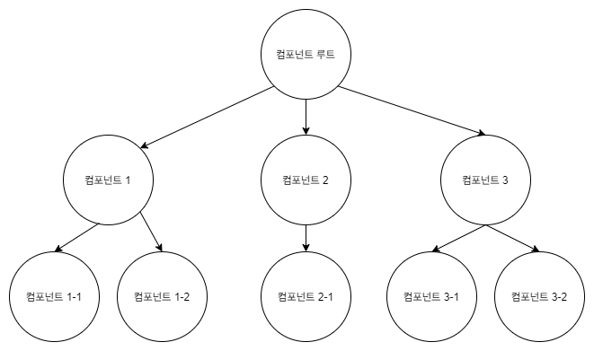

## Context API

여러 개의 컴포넌트로 구성된 애플리케이션에서는 컴포넌트와 컴포넌트가 통신하기 위해 각기 다른 프론트엔드 프레임워크, 라이브러리에서는 다양한 방법으로 데이터를 넘겨 주거나 받는다. 주로 `props`라는 개념으로 부모가 자식에게 속성을 넘겨주어 자식은 부모로부터 넘겨받은 데이터를 기반으로 어떠한 동작을 할 수 있다.

컴포넌트의 깊이가 그렇게 깊지 않다면 어떤 한 부모로부터 데이터를 건내받는 건 비교적 피곤한 일이 아니다. 하지만 컴포넌트의 깊이가 깊어지고, 데이터를 전달해주어야 할 부모로부터 거리가 멀어진다면 데이터를 건내 받을 자식 컴포넌트와 데이터를 건내주어야 할 부모 컴포넌트 사이의 모든 컴포넌트가 해당 부모로부터 `props`를 전부 받아 아래로 아래로 전달해야 한다.

만약 부모와 자식 컴포넌트 사이의 컴포넌트가 그 `props`에 대해 알 필요가 없으며 해당 컴포넌트에서 사용하지 않을 데이터라면 `props`로 받을 필요가 없다. 이런 문제를 해결하기 위해 리액트에서는 **Context API**를 제공한다.



## Context 만들기

리액트에서 제공하는 `createContext` 메서드를 이용해 데이터를 가지고 있을 컨텍스트를 만들 수 있다.

```js
// context/text-content.js
import React from 'react'

const context = React.createContext({
  text: ''
})

export default context
```

컨텍스트를 파일로 분리하고 내보낸다.

```js
// context/text-provider.js
import React from 'react'
import Context from './text-context'

export default function Prodiver(props) {
  return <Context.Provider {...props}>{props.children}</Context.Provider>
}
```

하위 컴포넌트들에게 값을 제공할 `Provider`를 파일로 분리해서 내보낸다.

```js
// App.js
import React, { useState } from 'react'
import SomeComponent from './components/SomeComponent'
import Provider from './context/text-provider'

export default function App() {
  const [text, setText] = useState('hello')

  return (
    <div className="App">
      <Provider value={{ text: text }}>
        <SomeComponent />
      </Provider>
      <button onClick={handleToggle}>toggle</button>
    </div>
  )
}
```

부모는 `text`라는 상태 값을 가지고 이 값을 `Provider` 하위 컴포넌트들에게 전달한다.

```js
import React, { useContext } from 'react'
import TextContext from '../context/text-context'

export default function SomeComponent() {
  const { text } = useContext(TextContext)

  return (
    <div>
      <p>I am Some Component</p>
      <p>{text}</p>
    </div>
  )
}
```

자식 컴포넌트에서 `useContext`를 사용해 컨텍스트의 값을 가져올 수 있다. 인자로 컨텍스트를 넘겨주면 값을 반환한다.

```js
// App.js
export default function App() {
  const [text, setText] = useState('hello')

  function handleToggle() {
    if (text === 'hello') {
      setText('toggled!')
    } else {
      setText('hello')
    }
  }

  return (
    <div className="App">
      <Provider value={{ text: text }}>
        <SomeComponent />
      </Provider>
      <button onClick={handleToggle}>toggle</button>
    </div>
  )
}
```

부모 컴포넌트의 상태가 변경되면 하위 컴포넌트는 재렌더링된다. 이 내용을 테스트 해보기 위해 버튼을 누르면 상태 값이 바뀌는 간단한 이벤트를 작성하고 테스트 해본다.
